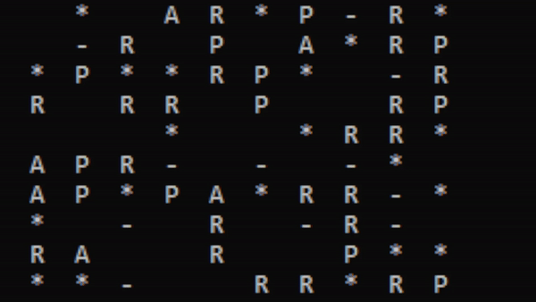

# Ocean
Console application с++.
Simulates the behavior of creatures in the ocean.



## Run and Build
```
mkdir build & cd build
```
with decrptions of action:
```
cmake -DPRINT_ACTIONS=ON .. 
```
whithout:
```      
cmake -DPRINT_ACTIONS=OFF ..
```
```
cmake --build .
.\Ocean.exe
```

## icon
- '*' - Stone
- '-' - Reef
- 'P' - Prey
- 'R' - Predator
- 'A' - ApexPredator

